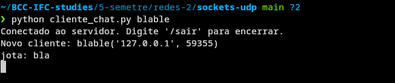
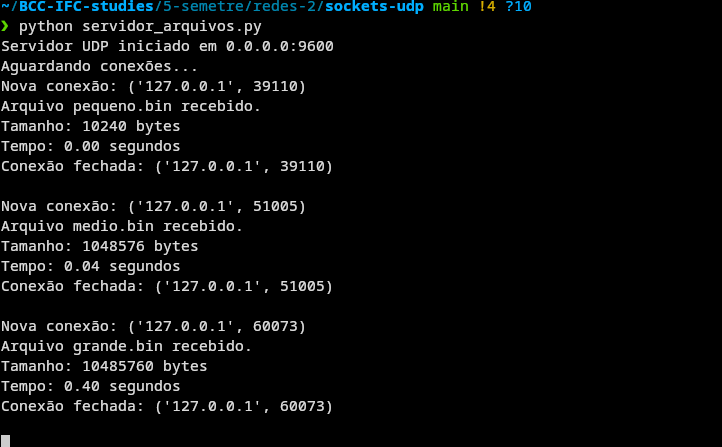
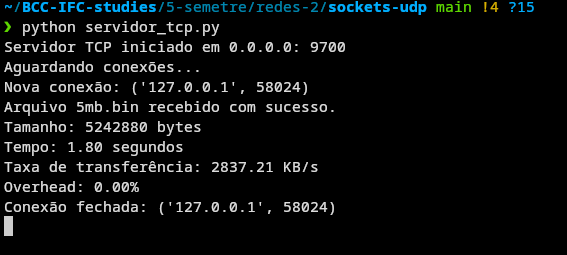

# Exercícios UDP

## Atividade 1 - Funcionamento do servidor e cliente




## Atividade 2

### Obs.
As prints mostram uma versão um pouco desatualizada do cliente. Na versão mais nova,
o progresso é mostrado dessa maneira:
```bash
Progresso {fragmento atual}/{total de fragmentos}.
```
Tudo em uma mesma linha, usando o comando `print` com `\r` e `end=""`.

### Arquivo pequeno


### Arquivo médio


### Arquivo grande


### Servidor



## Atividade 3 Parte 2

Realizei o teste com a mesma máquina pela falta de outra máquina disponível.

### Cenário 1

Com UDP:


Com TCP:


### Cenário 2

Comando usado para afetar o desempenho da rede loopback:
```bash
sudo tc qdisc add dev lo root netem loss 5%
```

Com UDP:


Com TCP:


### Cenário 3

Comando usado para afetar o desempenho da rede loopback:
```bash
sudo tc qdisc add dev lo root netem delay 100ms
```

Com UDP:


Com TCP:



### Análise dos cenários e TCP vs. UDP

É interessante visualizar como uma implementação "gambiarra" de sistema de ACKs no UDP
não chega perto da performance do TCP (razão de performance TCP/UDP no cenário 1: 8.6),
mesmo com o UDP sendo mais rápido em geral.
É perceptível que o UDP existe um overhead maior por conta do controle de fragmentação caseiro.
Embora o TCP tenha um cabeçalho maior, a parte de controle de fluxo e confiabilidade é melhor gerida em comparação ao UDP, pois esta etapa está em mais baixo nível, sendo dessa maneira otimizada.
Isso nos mostrá a importância de realizar a escolha certa de protocolo para o tipo de aplicação.

## Perguntas de reflexão
#### Quais foram os principais desafios ao implementar aplicações com UDP?
Os principais desafios foram a implementação do controle de fragmentação e a implementação do controle de ACKs. O controle de fragmentação foi desafiador, pois o UDP não possui um tamanho máximo de pacote definido, o que torna difícil determinar quando um pacote deve ser fragmentado. O controle de ACKs foi desafiador, pois o UDP não possui um mecanismo de confirmação de recebimento, o que torna difícil garantir que os pacotes sejam entregues corretamente.

#### Como você contornou a falta de garantias de entrega do UDP?
A falta de garantias de entrega do UDP foi contornada implementando um controle de fragmentação e um controle de ACKs. O controle de fragmentação garante que os pacotes sejam divididos em partes menores, o que facilita a entrega. O controle de ACKs garante que os pacotes sejam confirmados pelo receptor, o que garante que os pacotes sejam entregues corretamente.

#### Em quais situações você recomendaria o uso de UDP ao invés de TCP?
O UDP seria recomendado em situações onde esse controle não é necessário (como muito bem divulgado no material), como em aplicações de streaming de vídeo ou áudio, onde a latência é mais importante do que a confiabilidade. O UDP também é recomendado em aplicações de jogos online, onde a velocidade é mais importante do que a confiabilidade. Já o TCP é recomendado em aplicações onde a confiabilidade é mais importante do que a velocidade, como em aplicações de transferência de arquivos ou em aplicações web.

#### Como o comportamento do UDP poderia impactar aplicações de tempo real?
O UDP impacta aplicações de tempo real de maneira positiva, possibilitando uma latência menor. Sem ele, o mundo de streaming e jogos seria muito limitado comparado ao que temos hoje. Assim como ligações de voz e vídeo sofreriam com latência alta caso o UDP não existisse.
